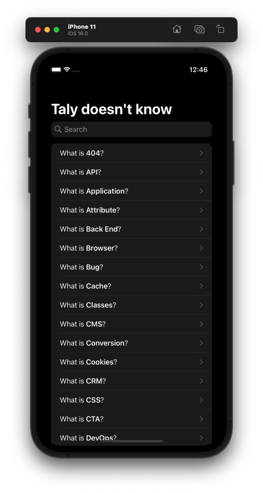
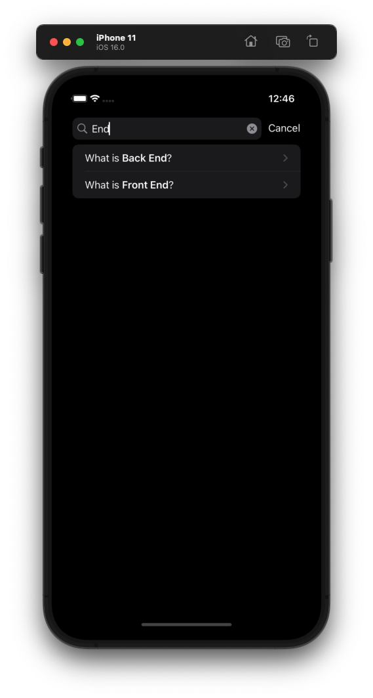
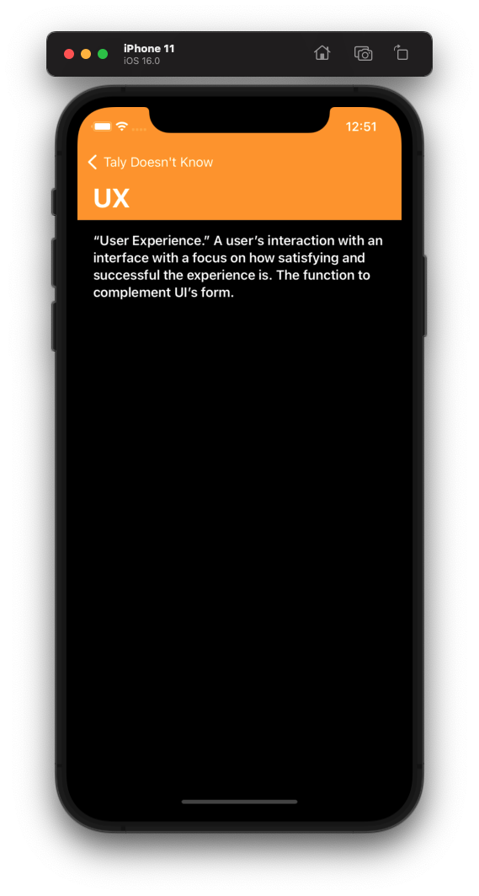

#
# Taly Doesn't Know
A sample app built for a blitz talk on how to start coding with SwiftUI


## Screenshots







## Tutorial

1. Dark mode (`preferredColorScheme`) - ⇧⌘A in the simulator
2. Change view to `Text` **only** - “What is **Application**?” (** like whatsapp)
3. `List` with 3 hardcoded `Texts` - Explain what will happen if I want to change the UI of the item
4. Create `struct Item` inside `Item.swift`
    - Copy to `Item.swift`:
        
        ```swift
        let items: [Item] = [
            .init(name: "404", description: "Error message when what was requested cannot be found; often because the link that was requested is either broken or dead."),
            .init(name: "API", description: "“Application Program Interface.” How computers and applications communicate with one another."),
            .init(name: "Application", description: "Also known as an app, these are programs designed to perform functions. This includes mobile apps."),
            .init(name: "Attribute", description: "Information about elements of a component in your website design/build."),
            .init(name: "Back End", description: "All of the behind-the-scenes digital operations that it takes to keep the front end of a website running, such as the coding, style, and plugins. If the front end of your website is what the audience sees onstage, the back end encompasses the stagehands, makeup artists, costumers, tech crew, stage managers, etc. simultaneously running the show from backstage."),
            .init(name: "Browser", description: "The program you use to access the Web — such as Chrome, Firefox, or Safari. When you experience an issue with a website, it’s best to send the browser type and version you’re using to your developer as oftentimes these issues are browser specific. You can figure this out easily thanks to WhatsMyBrowser.org."),
            .init(name: "Bug", description: "An error or flaw in the website or app that keeps it from running as expected."),
            .init(name: "Cache", description: "The storage of certain elements to help with faster load times from repeat website visitors. Often developers will tell you to clear your browser’s cache if they make a change on the website that you can’t see — most likely your cache is holding onto an older version and hasn’t made room for the new one yet. (Kind of like that period of time between you moving to college and your parents converting your childhood bedroom into a home-office–slash–exercise-room.)"),
            .init(name: "Classes", description: "In CSS, an identifier for specifying exactly what you what to target with styling. In other programming languages, classes are a bit more broadly used as the blueprint for creating something — similar to using the blueprint of an existing car to create a new type of car."),
            .init(name: "CMS", description: "\"Content Management System.\" The program that you use to create and maintain your website’s content. These are usually designed for non-developers for ease-of-use. Our personal favorite at Whole Whale is WordPress."),
            .init(name: "Conversion", description: "The goals you have for RGS (really good stuff) happening on your website, such as donations, email signups, and downloads. If your user and your website were in a relationship, this is when they would say \"I love you.\""),
            .init(name: "Cookies", description: "The source of all that is good, chocolatey, and sugary in the world… Kidding. (Sort of.) This is the data sent by an Internet server to a browser. Each time the browser accesses the same server, it sends the data back as a means of tracking how (and how often) it accesses the server. This is why your home computer always knows your Netflix login."),
            .init(name: "CRM", description: "\"Customer Relationship Management.\" In website development this refers to the software and applications used to gather, analyze, and maintain information on customers, donors, and prospects."),
            .init(name: "CSS", description: "\"Cascading Style Sheet.\" Code that tells browsers how to display a webpage for the end user. This programming formats fonts, colors, and other visual elements. When redeveloping a website, editing these elements in the mockup/GUI phase is much easier than changing in CSS."),
            .init(name: "CTA", description: "\"“Call to Action.\" The buttons on your website that drive certain conversions or goals such as donations, newsletter signups, or user registrations."),
            .init(name: "DevOps", description: "\"Development Operations.\" System of working that helps to keep development, IT operations, and quality assurance departments on the same page to make for better end-products and collaborations."),
            .init(name: "Domain", description: "The address for a website as entered into the browser (ours is www.wholewhale.com!). If your server is the land your website is built on and the hosting is its house, the domain is its mailing address."),
            .init(name: "Firewall", description: "System to protect a secure network from an unsecure network (i.e., the rest of the Internet)."),
            .init(name: "Framework", description: "Suite of programs used in website or software development. This lays the groundwork for the type of programming language used for your site or app development."),
            .init(name: "Front End", description: "The part of the website or app that the user sees. If the back end of your website is everything behind-the-scenes, this is what happens onstage."),
            .init(name: "FTP", description: "“File Transfer Protocol.” Method of exchanging files from one computer to another. This is also how websites are uploaded to the Internet."),
            .init(name: "GUI", description: "\"Graphical User Interface.\" The image of how a website is laid out and meant to be interacted with. In website design, this is how everything will ideally look in layout (your mileage may vary when you move into development given the number of different browsers and versions)."),
            .init(name: "HTML", description: "“Hypertext Markup Language.” The coding language used to build a website in terms of both form and function."),
            .init(name: "Plugin", description: "Modules or software that can be added (“plugged in”) to a system for added functionality or features."),
            .init(name: "Responsive Design", description: "Websites that accommodate the screen on which they’re being viewed. This became a huge trend in website design when browsing on mobile and tablet devices became more popular, which has led many developers to opt for a “mobile-first” approach — optimizing a website design for phone and tablet use first and then making sure it looks good on a laptop/desktop."),
            .init(name: "SAAS", description: "“Software As A Service.” The most basic of cloud platforms; allows users to share files and collaborate on projects through their browser. Some SAAS platforms include Google Drive and Dropbox. Other cloud options are Platform as a Service (PAAS; Facebook, Twitter, etc.) and Infrastructure as a Service (IAAS; Amazon Web Services, Microsoft Azure)."),
            .init(name: "Server", description: "Computers running software that allows users to access your website — this is what houses the hosting. If your domain is the website’s mailing address and the hosting is its house, the server is the land it’s built on."),
            .init(name: "UI", description: "“User Interface.” The visual elements that go into a website or app. This is the form to UX’s function."),
            .init(name: "UX", description: "“User Experience.” A user’s interaction with an interface with a focus on how satisfying and successful the experience is. The function to complement UI’s form."),
            .init(name: "Widgets", description: "Applications that allow for specific interactive functions to be performed on a website."),
            .init(name: "Wireframe", description: "The bare bones structure of a website. No fonts, colors, or images, this layout is the first step to making sure that the foundation is sound before content is added."),
            .init(name: "WYSIWYG", description: "“What You See is What You Get.” A visual content editor within CMS that allows you to modify content in your website without needing to know HTML. If you’ve ever made text in your website bold just by highlighting and clicking “Bold,” you were using WYSIWYG."),
        ]
        ```
        
5. `ForEach(items)`
6. `NavigationView` and `navigtaionTitle`
7. Create `DescriptionView` and `NavigationLink`
8. Add `let item: Item` property, add it to preview (`items[0]`) and to the `NavigationLink`
9. Add `VStack` , `Spacer` , `.padding()` and `.bold()`
10. `NavigationView` (in previews) and `navigationTitle(item.name)`
11. `.toolbarBackground` for color and visibility
12. `.accentColor(.white)` on `NavigationView` to color back button
13. `.searchable` on `List` with `@State searchText` property
14. update `ForEach` to `searchResults`
    - Copy to under `ContentView` `body`
        
        ```swift
        var searchResults: [Item] {
                if searchText.isEmpty {
                    return items
                } else {
                    return items.filter { $0.name.contains(searchText) }
                }
            }
        ```